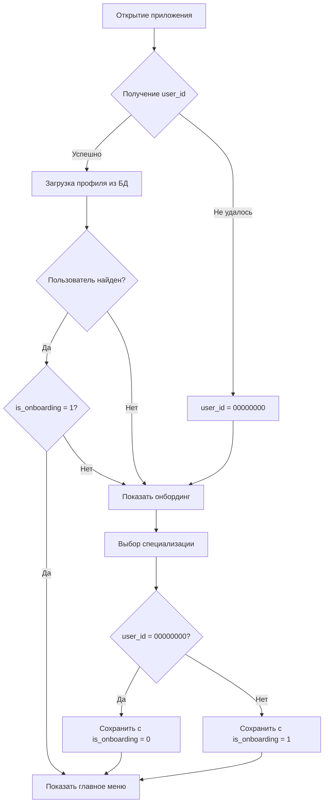

# Реализация онбординга в мини-приложении

## Описание функциональности

При открытии мини-приложения реализована следующая логика:

1. **Проверка пользователя в БД**:
   - Если пользователь не найден в БД или у него `is_onboarding = 0`, открывается экран выбора специализации
   - После выбора специализации пользователь сохраняется в БД с `is_onboarding = 1`

2. **Обработка отсутствия ID пользователя**:
   - Если ID пользователя не удается получить из Telegram, он регистрируется под стандартным ID `00000000`
   - Для таких пользователей после выбора специализации устанавливается `is_onboarding = 0` (а не 1)

## Изменения в коде

### 1. webapp/app.js

**Добавлены функции**:
- `getUserId()` - получение ID пользователя с fallback на стандартный ID
- `saveUserId()` - сохранение ID пользователя в localStorage
- `createOnboardingScreen()` - создание экрана выбора специализации
- `selectSpecialization()` - обработка выбора специализации
- `showOnboardingScreen()` - показ экрана онбординга

**Изменена функция**:
- `loadUserProfile()` - добавлена проверка статуса онбординга

**Изменена логика инициализации**:
- После загрузки профиля проверяется флаг `AppState.needsOnboarding`
- Если онбординг требуется, показывается экран выбора специализации вместо главного меню

### 2. webapp/index.html

**Добавлен новый экран**:
- Экран онбординга с ID `onboarding` для выбора специализации

### 3. webapp/api/app.py

**Обновлены endpoints**:
- `GET /api/profile/<user_id>` - теперь возвращает поле `is_onboarding` и статус 404 если пользователь не найден
- `POST /api/profile/<user_id>` - поддерживает сохранение поля `is_onboarding`

## Логика работы

## Тестирование

Для тестирования функциональности:

1. Откройте мини-приложение с новым пользователем
2. Должен появиться экран выбора специализации
3. После выбора пользователь попадает на главное меню
4. При повторном открытии онбординг не показывается

Для тестирования с гостевым ID:
1. Откройте приложение в режиме, где Telegram не передает user_id
2. Приложение использует ID `00000000`
3. После выбора специализации `is_onboarding` остается 0 